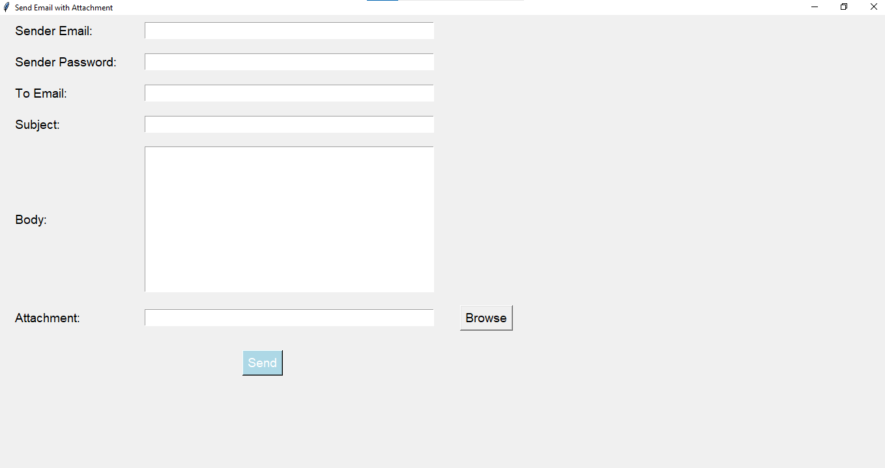

# Sender_Email
It can be used to send email. 
 This Python script is a simple email sending application built with tkinter for the graphical user interface (GUI) and smtplib for sending emails. It allows users to send an email with an optional attachment through a Gmail account. Users can input the sender's email, password, recipient's email, subject, body content, and attach a file using a file dialog. The program handles email creation, attachment encoding, and sending through Gmail's SMTP server. 

<b>Features:</b> 
<b>User-friendly GUI:</b> Built with tkinter for ease of use. 
<b>Email with Attachment:</b> Supports sending an email with an optional file attachment. 
<b>Secure Email Sending:</b> Uses Gmail's SMTP server with TLS encryption. 
<b>Error Handling:</b> Displays error messages in case of any issues during email sending or file attachment. 
 To use the application, users need to enter their Gmail credentials, which may require setting up an app-specific password if 2FA is enabled. 
 
[Repo Link](https://github.com/DwivediAmar/Sender_Email)
